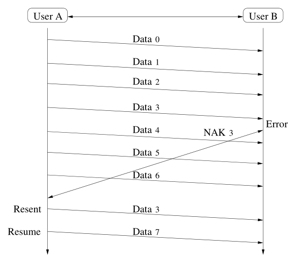
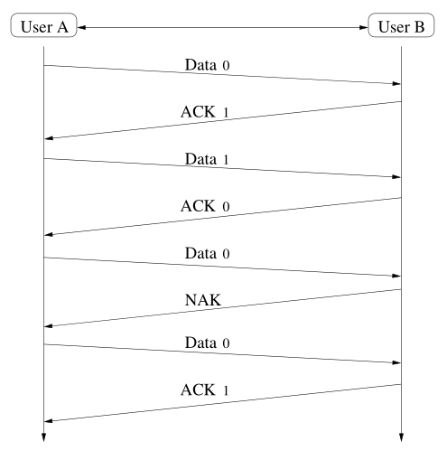
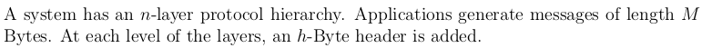
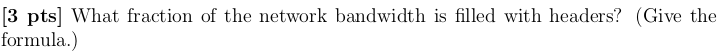
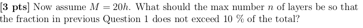
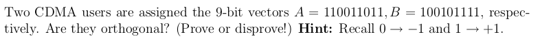
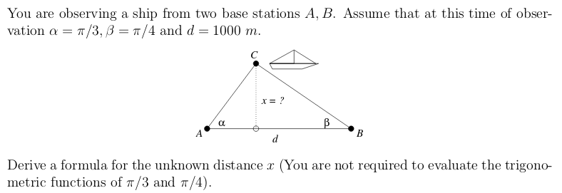

---
author: |
  | William Findlay
  | et al.
title: |
  | COMP3203 Final Exam Notes
date: \today
bibliography: /home/housedhorse/.bibs/uni.bib
csl: /home/housedhorse/.bibs/ieee.csl
subparagraph: yes
header-includes: |
  ``` {=latex}
  \usepackage{float}
  \usepackage{listings}
  \usepackage[hang,bf]{caption}
  \usepackage{framed}
  \usepackage[section]{placeins}

  \allowdisplaybreaks

  % fancy headers/footers
  \makeatletter
  \usepackage{fancyhdr}
  \lhead{\@author}
  \chead{}
  \rhead{\@title}
  \lfoot{}
  \cfoot{\thepage}
  \rfoot{}
  \renewcommand{\headrulewidth}{0.4pt}

  \usepackage{amsmath, amsfonts,amssymb, amsthm}
  \usepackage{siunitx}
  \usepackage[boxruled,lined,linesnumbered,titlenumbered]{algorithm2e}

  \usepackage{setspace}
  \usepackage{changepage}
  \usepackage[explicit]{titlesec}
  \usepackage{aliascnt}

  \floatplacement{figure}{!htb}
  \floatplacement{table}{!htb}
  \lstset{mathescape=true,numbers=left,breaklines=true,frame=single,language=python}
  \setlength{\captionmargin}{1in}

  \newgeometry{margin=1in}

  \newtheoremstyle{plain}
  {12pt}   % ABOVESPACE
  {12pt}   % BELOWSPACE
  {\itshape}  % BODYFONT
  {0pt}       % INDENT (empty value is the same as 0pt)
  {\bfseries} % HEADFONT
  {.}         % HEADPUNCT
  {5pt plus 1pt minus 1pt} % HEADSPACE
  {}          % CUSTOM-HEAD-SPEC

  \newtheoremstyle{definition}
  {12pt}   % ABOVESPACE
  {12pt}   % BELOWSPACE
  {\normalfont}  % BODYFONT
  {0pt}       % INDENT (empty value is the same as 0pt)
  {\bfseries} % HEADFONT
  {.}         % HEADPUNCT
  {5pt plus 1pt minus 1pt} % HEADSPACE
  {}          % CUSTOM-HEAD-SPEC

  \newtheoremstyle{remark}
  {12pt}   % ABOVESPACE
  {12pt}   % BELOWSPACE
  {\normalfont}  % BODYFONT
  {0pt}       % INDENT (empty value is the same as 0pt)
  {\itshape} % HEADFONT
  {.}         % HEADPUNCT
  {5pt plus 1pt minus 1pt} % HEADSPACE
  {}          % CUSTOM-HEAD-SPEC

  \theoremstyle{plain}

  % define theorem
  \newtheorem{theorem}{Theorem}[section]
  \providecommand*{\theoremautorefname}{Theorem}

  % define lemma
  \newtheorem{lemma}{Lemma}[section]
  \providecommand*{\lemmaautorefname}{Lemma}

  % define claim
  \newtheorem{claim}{Claim}[section]
  \providecommand*{\claimautorefname}{Claim}

  % define corollary
  \newtheorem{corollary}{Corollary}[section]
  \providecommand*{\corollaryautorefname}{Corollary}

  % define proposition
  \newtheorem{proposition}{Proposition}[section]
  \providecommand*{\propositionautorefname}{Proposition}

  % define conjecture
  \newtheorem{conjecture}{Conjecture}[section]
  \providecommand*{\conjectureautorefname}{Conjecture}

  \theoremstyle{remark}

  % define observation
  \newtheorem{observation}{Observation}[section]
  \providecommand*{\observationautorefname}{Observation}

  % define remark
  \newtheorem{remark}{Remark}[section]
  \providecommand*{\remarkautorefname}{Remark}

  \theoremstyle{definition}

  % define example
  \newtheorem{example}{Example}[section]
  \providecommand*{\exampleautorefname}{Example}

  % define definition
  \newtheorem{definition}{Definition}[section]
  \providecommand*{\definitionautorefname}{Definition}

  \newcommand{\blackbox}{\hfill$\blacksquare$}
  \usepackage{tikz}
  \newcommand*\circled[1]{\tikz[baseline=(char.base)]{
              \node[shape=circle,draw,inner sep=2pt] (char) {#1};}}

  \renewcommand{\labelitemi}{$\bullet$}
  \renewcommand{\labelitemiii}{\textbullet}
  \renewcommand{\labelitemiv}{-}

  \titleformat{\paragraph}
  {\itshape}
  {}
  {0em}
  {\underline{#1}}[ ]
  \titleformat{\subparagraph}
  {\itshape}
  {}
  {0em}
  {#1}[ ]

  \newcommand{\acro}[1]{\textbf{(#1))}}
  ```
output:
  pdf_document:
    number_sections: true
    fig_crop: true
    fig_caption: true
    keep_tex: false
---
\newpage
\pagestyle{plain}
\tableofcontents
\newpage
\pagestyle{fancy}

# Test 1 Stuff (Brief and Important Only)

## Units

|prefix|base 10 conversion|base 2 conversion|
|--:|:--|:--|
|pico|$10^{-12}$|$2^{-40}$|
|nano|$10^{-9}$|$2^{-30}$|
|micro|$10^{-6}$|$2^{-20}$|
|milli|$10^{-3}$|$2^{-10}$|
|---|$10^0$|$2^{0}$|
|kilo|$10^3$|$2^{10}$|
|mega|$10^6$|$2^{20}$|
|giga|$10^9$|$2^{30}$|
|tera|$10^{12}$|$2^{40}$|
|peta|$10^{15}$|$2^{50}$|

- $Hz \implies \text{cycles per second}$
  - $GHz \implies 10^9 \text{ cycles per second}$
  - etc.

## Equations

### Frequency and Period

- $T = \frac{1}{f}$
- $f = \frac{1}{T}$

### Wavelength

- $\lambda = vT$
- $f = \frac{v}{\lambda}$, since $f = \frac{1}{T} \implies \lambda = \frac{v}{f}$
  - for electromagnetic waves in a vacuum, $v = c$

### Bandwidth

- $B = \text{lowest frequency} - \text{highest frequency}$
  - $Hz$
  - $bps$
  - or any scalar of the above two

### Delay

- $\text{propagation delay} = \frac{\text{distance}}{\text{speed of light in medium}}$
- $\text{transmit delay} = \frac{\text{packet size}}{\text{bandwidth}}$
- $\text{queue delay} = \text{buffering and switching delays at nodes}$
- $\textbf{total delay} = \text{propagation} + \text{transmit} + \text{queue}$
- **RTT** or round-trip-time $= 2 \times \text{delay}$

### Delay Bandwidth Product

- $\text{\# of bits} = B \times D$
  - e.g., $\text{\# of bits} = 10bps \times 10s = 100b$
- this is the number of bits of data that can be sent before the first bit arrives
- we can send $2(B \times D)$ bits before we receive the first reply bit

### Shannon Capacity

- maximum theoretical capacity
- $C = B \log_2 \left(1 + \frac{S}{N}\right)$, where $\frac{S}{N}$ is the signal/noise ratio
  - high $\frac{S}{N} \implies$ good capacity 
  - low $\frac{S}{N} \implies$ poor capacity $\because \log_2(1 + 0) = 0$
- $\frac{S}{N}$ should be in $Db$

### Redundancy

- $\text{redundancy} = \frac{n + r}{n}$
- $r$ redundancy bits must cover $n + r$ bits for errors
  - in other words, $2^r$ must be able to express $n + r$ bits
  - this means $2^r > n + r$
  - or, $n < 2^r - r$

## Error Checking

- VRC
- LRC
- **CRC**
  - *this is usually used before ARQ*
- checksum

# ARQs

- **(A)**utomatic **(R)**epeat Re**(Q)**uests
- strategy to handle errors detected by the CRC
  - or whatever other detection method
- main types
  - **stop and wait**
  - sliding window
    - **go back N**
    - **selective reject**

## Sliding Window

### Go Back $N$

- most commonly used sliding window
- sequential frames numbered $n \mod N$
- send up to $N-1$ frames **before an ACK is received**
- **unbounded sequence numbers** is a hurdle for sliding window in
  **non-FIFO** channels

#### ACKs and NAKs

- if no error
  - send RR (ACK) for frame[$n$]
- if error
  - send REJ (NAK) for frame[$n$]
- if frame lost, send a NAK
- if no ACK or NAK received before *timeout*, **assume lost**

#### When Sender Receives a NAK[$n$]

- resend frame[$n$] and all frames sent since

#### When a Sender Receives No ACK or NAK

- go back to the previous ACK and resend all frames sent since

### Selective Reject

- similar to go back $N$
- **BUT** we only resend the **lost frame**
  - out of order!
  - receiver needs *sorting logic* to store frames after a NAK
- in general, smaller window size

{height=30%}

\FloatBarrier

## Stop and Wait

- also called an **ABP**
  - *alternating bit protocol*
  - because the label bits alternate between `0` and `1`
- you can think of it as sliding "window" with a **window size of 1**
- works only in **FIFO queues**
  - suitable for **data link layer**

{height=30%}

### Errors in Stop and Wait

- two main types
- **frame** errors
  - damaged frame
- **ACK** errors
  - damaged acknowledgement

\FloatBarrier

#### Frame Errors

{height=30%}

- frame is damaged
  - one or more bits have been altered
- discard the frame
- source waits for ACK
  - if it doesn't receive one, it will resend

\FloatBarrier

#### ACK Errors

- frame is received but ACK is damaged
- sender will resend message
- receiver will accept the same message twice
  - so we need to label frames
  - and label ACKs
  - use a bit for this
    - ACK[$b$] acknowledges frame[$b+1 \mod 2$]
    - says receiver is ready for frame[$b$]

{height=30%}

### Correctness

- satisfies:
  - safety
    - algorithm never gives an incorrect result
    - always results in a "corrected" error
  - liveness
    - never enters a deadlock condition

# Multiaccess

## LANs

- two types
  - **switched**
    - lines, multiplexes, switches
    - hierarchical addressing scheme
    - routing tables
  - **broadcast**
    - no routing
    - flat addressing scheme
    - \acro{M}edium \acro{A}ccess \acro{C}ontrol to coordinate transmissions
    - **preferred over switched** due to **simplicity**

## The Problem with Shared Channels

- in *point-to-point* networks we have signal as a function of one transmitted signal
- in *shared* networks, we may have **more than one** transmission contributing to a signal

## MAC Protocol

## Uncoordinated Access Control

## Ethernet

## Coordinated Access

### Tree Algorithm

### Binary Countdown

### Bitmap

# Wireless

## Cellular

## Ad Hoc

### UDG

### Compass Routing

### Face Routing

## Bluetooth

# GPS

## Three Techniques

## Satellites

# Routing

## Distance Vector (RIP)

## Link State Protocol (LSP)

## MSTs

## Dijkstra

# IP

## IPv4

### Classes of Address

### Subnets

### Subnet Masks

## IPv6

## DHCP

## ARP

### RARP

# TCP

## How it Works (Sliding Window)

## How it Builds Statistics

## Equilibrium Model

\newpage

# Sample Test

\renewcommand{\thesubsection}{\arabic{subsection}}

## <!-- 1 -->

{width=80%}

###

{width=80%}
\begin{align*}
\text{overhead} &= \frac{nh}{nh + M}
\end{align*}

###

{width=80%}
\begin{align*}
\text{overhead} &= \frac{nh}{nh + M}\\
10\% &\ge \frac{nh}{nh + 20h}\\
\frac{1}{10} &\ge \frac{n}{n + 20}\\
(n + 20)\frac{1}{10} &\ge n\\
(n + 20)\frac{1}{10} &\ge n\\
\frac{n}{10} + 2 &\ge n\\
n + 20 &\ge 10n\\
20 &\ge 9n\\
n &\le \frac{20}{9}\\
\end{align*}

###

{width=80%}

Take inner product of vectors in$\mod 2$.
\begin{align*}
\langle\vec{A},\vec{B}\rangle \mod 2 &= 1+0+0+0+1+0+0+1+1 \mod 2\\
&= 0 && \iff \text{orthogonal}
\end{align*}

## <!-- 2 -->

{width=80%}

\begin{align*}
\end{align*}

## <!-- 3 -->

## <!-- 4 -->

## <!-- 5 -->

## <!-- 6 -->

## <!-- 7 -->
