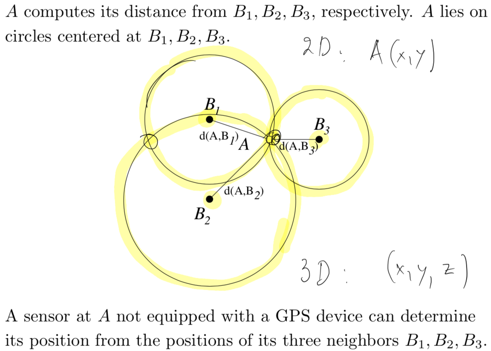
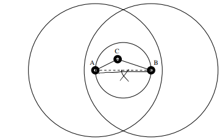
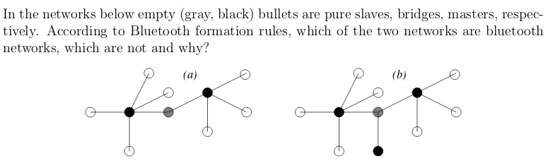

---
author: |
  | William Findlay
  | et al.
title: |
  | COMP3203 Final Exam Notes
date: \today
bibliography: /home/housedhorse/.bibs/uni.bib
csl: /home/housedhorse/.bibs/ieee.csl
subparagraph: yes
header-includes: |
  ``` {=latex}
  \usepackage{float}
  \usepackage{listings}
  \usepackage[hang,bf]{caption}
  \usepackage{framed}
  \usepackage[section]{placeins}

  \allowdisplaybreaks

  % fancy headers/footers
  \makeatletter
  \usepackage{fancyhdr}
  \lhead{\@author}
  \chead{}
  \rhead{\@title}
  \lfoot{}
  \cfoot{\thepage}
  \rfoot{}
  \renewcommand{\headrulewidth}{0.4pt}

  \usepackage{amsmath, amsfonts,amssymb, amsthm}
  \usepackage{siunitx}
  \usepackage[boxruled,lined,linesnumbered,titlenumbered]{algorithm2e}

  \usepackage{setspace}
  \usepackage{changepage}
  \usepackage[explicit]{titlesec}
  \usepackage{aliascnt}

  \floatplacement{figure}{!htb}
  \floatplacement{table}{!htb}
  \lstset{mathescape=true,numbers=left,breaklines=true,frame=single,language=python}
  \setlength{\captionmargin}{1in}

  \newgeometry{margin=1in}

  \newtheoremstyle{plain}
  {12pt}   % ABOVESPACE
  {12pt}   % BELOWSPACE
  {\itshape}  % BODYFONT
  {0pt}       % INDENT (empty value is the same as 0pt)
  {\bfseries} % HEADFONT
  {.}         % HEADPUNCT
  {5pt plus 1pt minus 1pt} % HEADSPACE
  {}          % CUSTOM-HEAD-SPEC

  \newtheoremstyle{definition}
  {12pt}   % ABOVESPACE
  {12pt}   % BELOWSPACE
  {\normalfont}  % BODYFONT
  {0pt}       % INDENT (empty value is the same as 0pt)
  {\bfseries} % HEADFONT
  {.}         % HEADPUNCT
  {5pt plus 1pt minus 1pt} % HEADSPACE
  {}          % CUSTOM-HEAD-SPEC

  \newtheoremstyle{remark}
  {12pt}   % ABOVESPACE
  {12pt}   % BELOWSPACE
  {\normalfont}  % BODYFONT
  {0pt}       % INDENT (empty value is the same as 0pt)
  {\itshape} % HEADFONT
  {.}         % HEADPUNCT
  {5pt plus 1pt minus 1pt} % HEADSPACE
  {}          % CUSTOM-HEAD-SPEC

  \theoremstyle{plain}

  % define theorem
  \newtheorem{theorem}{Theorem}[section]
  \providecommand*{\theoremautorefname}{Theorem}

  % define lemma
  \newtheorem{lemma}{Lemma}[section]
  \providecommand*{\lemmaautorefname}{Lemma}

  % define claim
  \newtheorem{claim}{Claim}[section]
  \providecommand*{\claimautorefname}{Claim}

  % define corollary
  \newtheorem{corollary}{Corollary}[section]
  \providecommand*{\corollaryautorefname}{Corollary}

  % define proposition
  \newtheorem{proposition}{Proposition}[section]
  \providecommand*{\propositionautorefname}{Proposition}

  % define conjecture
  \newtheorem{conjecture}{Conjecture}[section]
  \providecommand*{\conjectureautorefname}{Conjecture}

  \theoremstyle{remark}

  % define observation
  \newtheorem{observation}{Observation}[section]
  \providecommand*{\observationautorefname}{Observation}

  % define remark
  \newtheorem{remark}{Remark}[section]
  \providecommand*{\remarkautorefname}{Remark}

  \theoremstyle{definition}

  % define example
  \newtheorem{example}{Example}[section]
  \providecommand*{\exampleautorefname}{Example}

  % define definition
  \newtheorem{definition}{Definition}[section]
  \providecommand*{\definitionautorefname}{Definition}

  \newcommand{\blackbox}{\hfill$\blacksquare$}
  \usepackage{tikz}
  \newcommand*\circled[1]{\tikz[baseline=(char.base)]{
              \node[shape=circle,draw,inner sep=2pt] (char) {#1};}}

  \renewcommand{\labelitemi}{$\bullet$}
  \renewcommand{\labelitemiii}{\textbullet}
  \renewcommand{\labelitemiv}{-}

  \titleformat{\paragraph}
  {\itshape}
  {}
  {0em}
  {\underline{#1}}[ ]
  \titleformat{\subparagraph}
  {\itshape}
  {}
  {0em}
  {#1}[ ]

  \newcommand{\acro}[1]{\textbf{(#1)}}

  \usepackage{siunitx}
  ```
output:
  pdf_document:
    number_sections: true
    fig_crop: true
    fig_caption: true
    keep_tex: false
---
\newpage
\pagestyle{plain}
\tableofcontents
\newpage
\pagestyle{fancy}

# Test 1 Stuff (Brief and Important Only)

## Units

|prefix|base 10 conversion|base 2 conversion|
|--:|:--|:--|
|pico|$10^{-12}$|$2^{-40}$|
|nano|$10^{-9}$|$2^{-30}$|
|micro|$10^{-6}$|$2^{-20}$|
|milli|$10^{-3}$|$2^{-10}$|
|---|$10^0$|$2^{0}$|
|kilo|$10^3$|$2^{10}$|
|mega|$10^6$|$2^{20}$|
|giga|$10^9$|$2^{30}$|
|tera|$10^{12}$|$2^{40}$|
|peta|$10^{15}$|$2^{50}$|

- $Hz \implies \text{cycles per second}$
  - $GHz \implies 10^9 \text{ cycles per second}$
  - etc.

## Equations

### Frequency and Period

- $T = \frac{1}{f}$
- $f = \frac{1}{T}$

### Wavelength

- $\lambda = vT$
- $f = \frac{v}{\lambda}$, since $f = \frac{1}{T} \implies \lambda = \frac{v}{f}$
  - for electromagnetic waves in a vacuum, $v = c$

### Bandwidth

- $B = \text{lowest frequency} - \text{highest frequency}$
  - $Hz$
  - $bps$
  - or any scalar of the above two

### Delay

- $\text{propagation delay} = \frac{\text{distance}}{\text{speed of light in medium}}$
- $\text{transmit delay} = \frac{\text{packet size}}{\text{bandwidth}}$
- $\text{queue delay} = \text{buffering and switching delays at nodes}$
- $\textbf{total delay} = \text{propagation} + \text{transmit} + \text{queue}$
- **RTT** or round-trip-time $= 2 \times \text{delay}$

### Delay Bandwidth Product

- $\text{\# of bits} = B \times D$
  - e.g., $\text{\# of bits} = 10bps \times 10s = 100b$
- this is the number of bits of data that can be sent before the first bit arrives
- we can send $2(B \times D)$ bits before we receive the first reply bit

### Shannon Capacity

- maximum theoretical capacity
- $C = B \log_2 \left(1 + \frac{S}{N}\right)$, where $\frac{S}{N}$ is the signal/noise ratio
  - high $\frac{S}{N} \implies$ good capacity 
  - low $\frac{S}{N} \implies$ poor capacity $\because \log_2(1 + 0) = 0$
- $\frac{S}{N}$ should be in $Db$

### Redundancy

- $\text{redundancy} = \frac{n + r}{n}$
- $r$ redundancy bits must cover $n + r$ bits for errors
  - in other words, $2^r$ must be able to express $n + r$ bits
  - this means $2^r > n + r$
  - or, $n < 2^r - r$

## Error Checking

- VRC
- LRC
- **CRC**
  - *this is usually used before ARQ*
- checksum

# ARQs

- **(A)**utomatic **(R)**epeat Re**(Q)**uests
- strategy to handle errors detected by the CRC
  - or whatever other detection method
- main types
  - **stop and wait**
  - sliding window
    - **go back N**
    - **selective reject**

## Sliding Window

### Go Back $N$

- most commonly used sliding window
- sequential frames numbered $n \mod N$
- send up to $N-1$ frames **before an ACK is received**
- **unbounded sequence numbers** is a hurdle for sliding window in
  **non-FIFO** channels

#### ACKs and NAKs

- if no error
  - send RR (ACK) for frame[$n$]
- if error
  - send REJ (NAK) for frame[$n$]
- if frame lost, send a NAK
- if no ACK or NAK received before *timeout*, **assume lost**

#### When Sender Receives a NAK[$n$]

- resend frame[$n$] and all frames sent since

#### When a Sender Receives No ACK or NAK

- go back to the previous ACK and resend all frames sent since

### Selective Reject

- similar to go back $N$
- **BUT** we only resend the **lost frame**
  - out of order!
  - receiver needs *sorting logic* to store frames after a NAK
- in general, smaller window size

{height=30%}

\FloatBarrier

## Stop and Wait

- also called an **ABP**
  - *alternating bit protocol*
  - because the label bits alternate between `0` and `1`
- you can think of it as sliding "window" with a **window size of 1**
- works only in **FIFO queues**
  - suitable for **data link layer**

{height=30%}

### Errors in Stop and Wait

- two main types
- **frame** errors
  - damaged frame
- **ACK** errors
  - damaged acknowledgement

\FloatBarrier

{height=30%}

#### Frame Errors

- frame is damaged
  - one or more bits have been altered
- discard the frame
- source waits for ACK
  - if it doesn't receive one, it will resend

\FloatBarrier

#### ACK Errors

- frame is received but ACK is damaged
- sender will resend message
- receiver will accept the same message twice
  - so we need to label frames
  - and label ACKs
  - use a bit for this
    - ACK[$b$] acknowledges frame[$b+1 \mod 2$]
    - says receiver is ready for frame[$b$]

{height=30%}

### Correctness

- satisfies:
  - safety
    - algorithm never gives an incorrect result
    - always results in a "corrected" error
  - liveness
    - never enters a deadlock condition

# Multiaccess

## LANs

- two types
  - *switched*: interconnection by means of transmission
    - lines, multiplexes, switches
    - hierarchical addressing scheme
    - routing tables
  - *broadcast*: information received by all users
    - no routing
    - flat addressing scheme
    - \acro{M}edium \acro{A}ccess \acro{C}ontrol to coordinate transmissions
    - *preferred over switched* due to *simplicity*

## The Problem with Shared Channels

- in point-to-point networks, received signal is a function of one transmitted signal
- In broadcast networks a single transmission medium is shared.
  Received signal is a function of possibly more than one
  transmitted signal

- How do we mediate access to shared channels?
  -Medium Access Control (MAC) sublayer between Physical and
   DLC (Data Link Control) is used to solve this problem

## MAC Protocol
- *Centralized*: A distinguished node (master) makes access
                   decisions for the remaining nodes (slaves).
  - Centralized schemes are too dependent on master failure and
    generally less efficient.
- *Distributed*: All nodes are equivalent and the access decision
                     is derived together in a distributed fashion.

## How do you share a medium?
- *Static Partitioning Schemes*: Partition transmission
                                   medium into separate dedicated channels.
- *MAC Schemes*: Dynamic and on-demand. However, must
                     minimize collisions.
           
## Some examples: Types of Networks
- Satellite channels (wireless)
  Iridium network
- Multitapped bus (wired):
  Ethernet
- Star topology with hub (wired)
  Fast Ethernet
- Packet radio networks (wireless)
  Ad Hoc, Bluetooth, Piconets, Wireless networks
- Cellular networks (wireless)
    Cell phones, Wireless LANs


 
## How Do You Mediate Access?
- Given that there are many users, several issues must be taken into account.
  1. Give access to each user that wants to communicate.
  2. Decide who talks first.
  3. Be fair to all.
 
- Let's work with the case of 2 hosts
  - We need to address the following
    1. Measure the Propagation Time
    2. Coordinate access.
    3. Select a winner.
    
## Measuring the Propagation Time(2 hosts)
- Let $T_{prop}$ be the bit-propagation time of a channel.
- Let d = “distance between the two stations” and v = “the speed of the medium”

Then we have: $$T_{prop} = \frac{d}{v}$$

- Both stations can measure $T_{prop}$, can use ping
- So we can assume they both have the same value for $T_{prop}$.

- $T_{prop}$ is also $$\frac{RTT}{2}$$

## Access Coordination Algorithm(2 hosts)

\begin{lstlisting}
A (B) listens to channel
if channel not busy:
  A (B) transmits packet
  A (B) continues to listen to channel
  if B (A) has not began transmission "by time $T_{prop}$":
    A (B) is certain packet will reach B (A)
  else:
    A (B) detects collision and retransmits.
\end{lstlisting}

- If user A is to be able to detect a collision it must occupy
the channel for a time period of 2$T_{prop}$ time units.

- Note: Since both stations can measure $T_{prop}$ , at the latest, by
time 2$T_{prop}$ , A will know if a collision occurred

- Stations measure time $T_A$ ($T_B$) from the beginning of (their own)
packet transmission to the time a collision occurs.

### Conditions for the winner
- Stations A and B can compare $T_A$ and $T_B$ with $T_{prop}$.
  $T_A < T_B \iff T_A < T_{prop}$

  1. A wins $\iff T_A < T_B$.
  2. Losing station remains quiet until winner completes
       transmission.
  3. For the sake of fairness, after completing transmission, the
     winner remains quiet for 2$T_{prop}$ time units to allow the loser
     to capture channel.
     
## Efficiency
- For each packet sent, 2$T_{prop}$ time is required to coordinate
access.
- If bit rate is R and packet length is L then channel efficiency is
\begin{align*}
&\phantom{=}\frac{L}{L+2T_{prop}}\\
&= \frac{1}{1 + \frac{2T_{prop}}{L}}\\
&= \frac{1}{1 + 2a} && \text{where } a = \frac{T_{prop}}{L}
\end{align*}

- small $a \implies$ more efficient channel

*Note* The prof also gave us that overhead: $$\frac{L+2T_{prop}}{L}$$

$$a=\frac{dR}{vL}$$ 

<!-- refer to performanceTable.png -->


## Scaling Ethernet
- In Ethernet, where there is broadcasting type of message
passing, every node is always listening to the network and may
initiate transmission only when the network is silent.

- The network is a broadcast media in which every node can hear
every other node.

- In order for two nodes not to send data simultaneously in a
quiet network, nodes must listen to their transmissions, and if
the data a node reads from the Ethernet does not match the
data it is placing on the Ethernet, it knows that a collision has
occurred.

- Whenever a collision occurs, a node stops sending and waits a
random time before attempting to retransmit.

## Limitations of Ethernet: Distance Factor
- In a 10 Mb Ethernet, the minimum packet size is 64 bytes for a
5 km cable.

- In a 1 Gb Ethernet, the minimum packet size is about 6400
bytes.

- From an architectural perspective 6400 bytes is too large a
number for the minimum packet size.

## Other Issues
- Medium access protocol is very technology dependent!
- Can we be sure that measurements are accurate?
- Even “Echo” measurements may differ for two hosts!

Nevertheless, resulting protocols are realistic and efficient because
they are on-line


Some LAN Devices: Host, network bridge, network hub, network transceiver

# Wireless

## Dynamic

- Wireless networks is a group of nodes in range of each other
- BBS (Basic Service set) is a group of nodes
- BSA (Basic service area) is the geographic area covered by a BSS
- Each BSA has an AP (access point)
- ESS (Extended service set) is used to extend a set of BSS
- For a node to join an ESS it must associate with an AP


## Spread Spectrum

- Spread information over wider bandwidth to make jamming or interception harder
- Two types of spread techniques
  - Direct Sequencing
  - Frequency Hopping
- We do this to hide / encrypt signal avoid noise and use independent same bandwidth (CDMA)
  DSSS (Direct Sequence Spread Spectrum)
- Let n be the number of bits we transmit at a time
- Sender randomly generates $b$ bits, $b_1,b_2,\ldots,b_n$. Each bit gets XOR by $b$ the original bit
- Implemented in physical layer
- Not a multi access method
- XOR bit data by chip

## FHSS (Frequency Hopping Spread Spectrum)

- Let B be the number of bits and n being the number of channels to hop
- Hops frequency sending B/n bits on each frequency (loop once all n channels visited)
- Time user stays in a band in called dwell time

## CDMA: Code Division Multiple Access
- Multiplexing (Allowing multiple users to communicate over the same time on the same channel)
- Break each bit into k chips according to a fixed pattern called the user’s code
- New channel has chip data rate (k * R) chips per second.

## Sharing Methods Over a Channel With CDMA

- Exclusive FDMA or TDMA
- Simultaneous use of FDMA and TDMA
- Calls are distinguished along the “code” dimension
- All calls may share the same frequency since each transmission s assigned a unique code
- Analogy is a cocktail party which people talk in different languages at the same time. Now the issue is controlling volume.
- Example if chip code is (1, -1, -1, 1, -1, 1)
  - Send 1 bit send the chip code
  - Send 0 bit send the compliment of the chip code which is (-1, 1, 1, -1, 1, -1)
- Each user in U owns a specific bit pattern consisting of n bits (b1,…,bn)

## Selecting Patterns for CDMA

- Let $\vec{U}$ be assigned a vector which is either -1 or 1 for an $n$ generated bit sequence.
- Let $\bar{u} = (-u_1,\ldots,-u_n) be components of \vec{U}$
- Let $\vec{u} = (u_1,\ldots,u_n)$
- Let the inner product of $\langle u, \rangle> = 1$ and $\langle u, \bar{u}\rangle = -1$
- Transmission: Transmit bit 1 user U send its vector u, transmit 0 send compliment u
- Example to send 1011 given A has code 00011011 we send a(compliment a)aa etc.

## Decoding CDMA
- Compute $\langle u, \sum_{v \in S}(Bv)\rangle$

## Collision Avoidance
- B and C will collide if they transmit at the same time
- A can reach B but is unaware of C
- C can reach B but is unaware of A


##  Exposed Node
- Nodes can transmit but other nodes in the range of that given node can hear that node

##  Communication Paths in Wireless
- Each node can propagate a message to the next for instance given A,B,C,D,E,F,G and each node is in range of the next we can form a path from A to G even if A is not in range of G.
- Asymmetry in networks are when we have to nodes which one node can reach the other but not vice versa.

## Attenuation
- The farther away a device is from a base station the more objects in its way

##  Power Levels
- TPC (Transmission Power Control) Algorithm
- Attempts to equalize power transmitted to received signal powers

##  Interference
- When two signals over lap transmissions will be coupled

##  Signal to Interference Ratio (SIR)
- Device tells base station to lower or increase power of transmission

##  MACA (Multiple Access Collision Avoidance) Algorithm
- Sender sends (RTS) request to send which includes how long it wants to use the medium.
- Receiver replies with CTS (Clear to send)
- If CTS not received after a timeout then Back off algorithm is executed
- Receiver sends ACK after receiving
- All other nodes must wait for ACK before transmitting

##  Nodes are NOT All Equal
- In a distributed system node transmit over access points
  - Scanning for Access Points
  - Station sends Probe frame
  - If AP is in range respond with Probe response frame
  - Station selects AP and responds with Association Request frame
  - Access Point responds with Association Response frame

## IEEE 802.11: Framers

- Three types of frames
  - MF (Management Frames): association, disassociation, timing, synchronization, authentication and de authentication
  - CF (Control Frames): Used for Handshaking and positive ACKs during an exchange
  - DF (Data Frames): Used for data for data transmission

## Bluetooth

- Piconets
- Star network
- Master is the central node slave nodes connect to master
- Communication is strictly Master -> Slave or Slave to Master
- All masters have at least 1 and at most 7 slaves
- Piconets can be enlarged to form scatter nets
- Master and slave can switch by using different frequencies
- Scatter nets care multiple Pico nets connected by bridges

## Scatter Net

- Network of Pico nets
- Consists of Masters and Slaves (Bridge or Pure)
- Two Masters can share only a single slave (Bridge)
- Piconet can only have at most 7 slaves
- Each bridge may only connect two Pico nets

## Bluetooth establishing links

- Start
- Synchronization
- Discovery
- Paging
- Connection established

## Discovery Delay Procedure

- To support spontaneous connectivity inquiry is used and connection are established based on information exchange
- Application sets Bluetooth into inquiry mode then sends inquiry msg to probe for other nodes
- Other Bluetooth devices will only listen unless set to inquiryScan
- Collision Avoidance which is the method used to avoid collision which uses some randomness

## Connection Establishment

- Takes several seconds
- Follows uniform distribution between inquiry and inquiryScan

## Bluetooth frames

- 72 Access Code 54 Header 0-2744 Data
- Header broken down is 3 Addr 4 Type 1 F 1 A 1 S 8 Checksum

## Broadband Wireless


\FloatBarrier

# GPS (Global Positioning System)

## Localization 
 - **Geographic location** 
   - defined by two coordinates 
     - **longitude** 
     - **latitude**
 - **Geographic localization** refers to **algorithms for** finding your **geographic location**
 - **Triangulation**: process of
   - **determining location** of a point
    - **comparing angles** to it from *known points*
   - **SOHCAHTOA**
<!--insert GPS_4, and GPS_5 here-->


- we have
\begin{align*}
d &= \frac{x}{\tan \alpha} + \frac{x}{\tan \beta}\\
d &= x\left(\frac{1}{\tan \alpha} + \frac{1}{\tan \beta}\right)\\
x &= d\frac{1}{\left(\frac{1}{\tan \alpha} + \frac{1}{\tan \beta}\right)}\\
x &= d\frac{\tan \alpha \tan \beta}{\tan \alpha + \tan \beta}
\end{align*}

### Another way to measure distance

Consider two sensors $A$ and $B$ at distance $D$.


\begin{lstlisting}
def algorithm:
  A sends signal to B in medium1
  B responds to A in medium2
  Both A and B measure RTT, say $T_1 = AB$ + $T_2 = BA$
  Solve for D as follows:
\end{lstlisting}

- Let $v_1$ and $v_2$ be prop speeds in medium1 and medium2
- two equations
  - $RTT = T_1 + T_2$
  - $v_1T_1 = v_2T_2$
- $v_1,v_2,T$ known
- $T_1,T_2$ unknown
- And so
\begin{align*}
T_1 &= \frac{v_2 T}{v_1 + v_2}\\
T_2 &= \frac{v_1 T}{v_1 + v_2}
\end{align*}

## Categories

- **network based**
  - use service provider network structure for location
- **handset based**
  - client software to determine location
- **hybrid based**
  - combination of the above two

## How it Works

- **Three position aware neighbours** are required for **2D**, and 4 for 3D
- A **base station** will **synchronize** the location **aware nodes/anchor** to emit signal at same time
  - using these signals, **sensor node** can **calculate its location**

## Three Techniques

### TOA (Time of Arrival)
- Computes its distance from three anchor nodes

<!--insert GPS_15-->
{width=80%}

### TDOA (Time Difference of Arrival)
- Time difference of arrival from two anchors $\vert t_1 - t_2\vert$
- Assuming **speed** is known, **measuring time** allow us to **calculate distance**
- $velocity = distance/time$ 

### AOA (Angle of Arrival)
  - **Sensor node determine directions of signals from two anchor** using array antennas
  - if the **two sensors** are on **same straight line, use a third anchor**
  - **Pros:** 2 anchor for 2D, 3 for 3D. No need for synchronization between anchors
  - **Cons:** line of sight needed for good accuracy. Accuracy decrease with distance. Large and complex hardware

<!--insert GPS_18-->
{width=80%}

- **Signal Strength Technique** (Not sure if needed)
  - Use the fact that **signal loses strength as a function of distance**
  - *P/d<sup>2</sup>*
  - Using three different signals, receiver can determine position similar to TOA
  - Easily disrupted by transmission phenomena, unreliable accuracy

## Satellites (For GPS)
 - **Earth-Centred Earth Fixed (ECEF):** cordite system based on aligning Earth axis
 - **How the receiver calculate its position**
   - Assume **clocks of receiver and all satellites** are perfectly **synchronized**
   - Calculation uses **triangulation with satellites**
   - Receiver measures the time $t_1$ for signal of satellite  to arrive
   - Since signal travels at speed of light $c$, distance $r_1 = ct_1$
   - Set of points situated at $r_1$ from $P_1$ form a sphere $S_1$ centered at $P_1$ with radius $r_1$
   - We know receiver is on $S_1$, consider the points as defined in a Cartesian coordinate system
   - If $(x, y, z)$ is unknown position of receiver and $(a_1, b_1, c_1)$ is known position of $P_1$ then $(x, y, z)$ describe the points on $S_1$ as:
   - Now we required 2 more satellites, as 1 is clearly not enough
   - So we get satellites $P_1$, $P_2$ and $P_3$ with positions $(a_1, b_1, c_1)$, $(a_2, b_2, c_2)$, and $(a_3, b_3, c_3)$ and equations
     - $(x-a_1)^2+(y-b_1)^2 + (z-c_1)^2 = r_1^2 =c^2t_1^2$
     - $(x-a_2)^2+(y-b_2)^2 + (z-c_2)^2 = r_2^2 =c^2t_2^2$
     - $(x-a_3)62+(y-b_3)^2 + (z-c_3)^2 = r_3^2 =c^2t_3^2$
   - Replace first equation with difference of 1st and 3rd
   - Replace second equation with difference of 2nd and 3rd
   - Keep 3rd equation as is
<!--insert GPS_32, GPS_33, GPS_34 and GPS_35-->
   - Substitute $x$, and $y$ into equation 3 which solve to get two solutions $z_1$ and $z_2$
   - Back-substitute $z$ for values $z_1$ and $z_2$ in the two other equations for $x_1$, $x_2$, $y_1$, and $y_2$ 
   - Formula becomes large very quickly and is inconvenient to get insight
   - **(not sure if things below are needed)**
   - Calculating special relativity (SR) and general relativity (GR) is mandatory
   - ECEF is useful for navigation but there are many easier options in inertial reference frame
   - A point in inertial frame is denoted by cylindrical space-time coordinates $(t, r, o, z)$
   - In ECEF is $(t', r', o', z')$
   - Coordinates are related as follows: $t-=t', r=r', o=o'+w_Et', z=z'$
     - $w_E$ is uniform angular velocity of Earth
   - **Issues**
     - Velocity of satellite clock and gravity field of earth can cause inaccuracy 
     - Concept of GPS is based on constant speed of light *c*
     - The atmosphere can cause refraction, reflection effects
     - Satellites and receivers may not be perfectly in sync
     - If you see more than four satellites always choose spheres that intersect with largest angle to minimize errors
<!-- insert GPS_39 -->

# Location Awareness

## Complexity in Models for Wireless Communication

- Traditional (wired, point-to-point) communication networks
can be described satisfactorily using a graph representation.
- A station s is able to transmit a message to another station s'
if and only if there is a wire connecting the two stations.
- Accurately representing a wireless network is considerably
harder, since it is nontrivial to decide whether a transmission
by a station s is successfully received by another station s'.
- This may depend on the positioning and activities of s and s',
and on other nearby stations, whose activities might interfere
with the transmission and prevent its reception

### A Lot of Factors
- This means that a transmission from s may reach s' in some
settings but fail to reach it under other settings.
- Moreover, the question of successful reception is more complex,
since connections can be of varying quality and capacity.
- There are many other relevant factors, such as:
  - the presence of physical obstacles
  - the directions of the antennae at s and s'
  - the weather, and more
- Obtaining an accurate solution taking all of those factors into
account involves solving the corresponding *Maxwell equations*
- Since this is usually far too complicated, the common practice
is to resort to approaches based on approximation models.

## Power Assignments
- When a sensor transmits to another sensor located at distance
d from the transmitting sensor, the power of the signal at the
receiving station is P/$d^2$, where P is the power of the signal at
the transmitting station

<!-- insert powerAssignment.png -->

{width=80%}

## Rayleigh’s Principle: Physical Model
- Consider the setting whereby sensors $S_1, S_2,...,S_k$ and S are
located in the plane and suppose that sensor $S_i$ is at distance
$d_i$ from S.
- When the signal from a transmitting station $S_i$ reaches the
sensor S it will have power $P_i/d_i^2$ , where $P_i$ is the power of the
transmitted signal at $S_i$.
- When the k sensors are transmitting at the time then
according to Rayleigh’s principle only the most “powerful”
signal can be received by sensor S.

- The signal from a sensor $S_i$, for some i, will be received by
sensor S if and only if there is a threshold  $\lambda$ > 0 s.t.

$$\frac{P_i}{d_i^2} > \lambda\left(N + \sum_{j=1,j \ne i}^n{\frac{P_j}{d^2_j}}\right)$$

which depends on technical considerations, like, sensor
equipment sensitivity, and N is ambience noise

- Usually, to simplify notation, we assume that $\lambda$ = 1, N = 0.

<!-- Insert rayleighExample.png -->

{width=80%}

### SINR (Signal-to-Interference & Noise Ratio)
- This formula represents a rather general model concerning the
allowed transmission power, referred to as the power control
model, in which each station can control the power with which
it transmits.
- A simpler (and weaker) model is the uniform wireless network
model, which assumes that all transmissions use the same
transmission power, i.e., $P_i$ = 1 for every i.

## Idealized Models

## Protocol Model: Equal Power Assumption!
- The disk indicates an omni-directional antenna!
- It is rare for two stations to have the same signal power!

<!-- insert antennae1.png -->

{width=80%}

- In the left picture A can reach B and B can reach A.
- In the right picture A can reach B but B cannot reach A.

### Connectivity conditions
- If the common radius of a transmission disk is r:
  - A can talk to B and B can talk to A $\iff$ B is inside A's disk and A is inside B's disk $\iff d(A,B) \le r\text{ and } d(B,A) \ge r$

## UDGs and Wireless
- Unit Disk Graphs (UDGs) are used in computer science to
model the topology of ad hoc wireless communication networks.
- Nodes are connected through a direct wireless connection
without a base station. It is assumed that all nodes are
homogeneous and equipped with omni-directional antennas.
- Node locations are modeled as Euclidean points(a,b), and the area
within which a signal from one node can be received by another
node is modeled as a circle.
  -$$(x-a)^2 + (y-b)^2 \le r^2$$
- If all nodes have equal transmission power, the circles are equal.
- Random geometric graphs, formed as unit disk graphs with
randomly generated disk centers, have also been used as a
model of percolation and various other phenomena.

### UDGs: Vertices and Edges
- The UDG is an abstract model of an ad hoc network.
  - It is a graph G(V,E) with V the set of vertices and E the
set of its edges.
  - V : Vertices are the sensor nodes.
  - E: Edges between vertices represent connectivity, i.e.,
whether or not they can communicate.

- Suppose 2 vectors u,v and edge(u,v) exists
  - $E(u,v) \iff d(u,v) \le r$
  
- Two mobile hosts A,B are adjacent if they are within reach of each other
- There is an edge A,B $\iff$ d(A,B) <= r, here r = 1
<!-- Look at udg0.png-->

### Examples of UDG
<!-- Look at udg1.png-->

## UDGs and Mobility
- The previous UDG model is static.
- If you want to include mobility then time t must be
incorporated in the model.
- $G_0, G_1,...,G_t,...$ is a sequence of UDGs whereby $G_t$ is the
“state of the ad hoc network” at time t.
- Given $G_t$ the new network $G_{t+1}$ is obtained from $G_t$ by the
addition/deletion of nodes/links.

## Gabriel Test
- Assume points A and B are within range of each other
<!-- Insert gabriel0.png -->
  1. Draw circle with diameter AB
  2. If there is another point, say C inside this circle then
remove the link connecting A to B (is not needed!)

{height=30%}

\begin{theorem}
Assume a connected wireless network with node
ranges represented as circles of identical radius. The Gabriel
algorithm removes all edge crossings!
\end{theorem}

### Gabriel Test: Observations
- Call AB a Gabriel edge if the circle with diameter AB contains
no other points.
<!-- insert gabriel1.png -->
- A point X is inside the circle with diameter AB $\iff$ the angle AXB is bigger than $\pi/2$.
- A point X is inside the circle with diameter AB $\iff$ its distance from the center of the circle is bigger than |AB|/2.

{height=30%}

### Gabriel Graph is Planar
- If the Gabriel edges AC and BD intersect, A, B, C, D must
form a convex quadragon!
<!-- insert gabriel2.png -->

{height=30%}

Hence $\angle ABC, \angle BCD, \angle CDA, \angle DAB < \pi/2$, contradicting the
fact that $\angle ABC + \angle BCD + \angle CDA + \angle DAB = 2\pi.$

### Why is edge BD preserved?(Same arguments for why edge AC is preserved)
<!-- insert gabriel3.png -->

{height=30%}

### Advantages of Gabriel Test
  - Remove crossings
  - Maintain connectivity
  - Removes interference

### Disadvantages of Gabriel Test
  - Takes time to process
  - Lost edges
  - Routing tables

### How about Deleted Edges?
You maintain a Routing Table

- A data base that when you are at A you ask:
  How do I reach B?
- It gives you the answer: Go to C
- And when you reach C you ask again:
  How do I reach B?
- It gives you the answer: Go to B.
- Standard routing table contains an entry for each possible
destination with the out-going link to use for destination
- Message delivery proceeds in the obvious manner one link at a
time, looking up the next link in the table.

## Planarity
- Planar Graph
  - A graph G is planar if it can be drawn in the plane in such
a way that no two edges meet except at a vertex with which
they are both incident.(A graph with no edge crossings)
  - Any such drawing is a plane drawing of G
  - A graph G is non-planar if no plane drawing of G exists
- The Gabriel test produces a planar network!
  - It was done by removing edges
- Sometimes it's impossible to draw planar graphs such as $K_{3,3}$, 3 vertices connecting to 3 other vertices

### Faces of a Planar Graph
- Every plane drawing of a planar graph divides the plane into a
number of regions.
  - For example, any plane drawing of $K_4$ divides the plane into
four regions: three triangles (3-cycles) and one infinite region

## Geometric Routing

## Routing in a Geometric Planar Network
Input: A geometric graph.
Goal. Go from source node s to target node t.
  - We need some kind of “capabilities” in order to move towards
the target t. This may include the following
    - Updating coordinates of current position c
    - Must know the coordinates of t.
    – If c is our current position we need to be able to determine
      the slope of the line ct.
  - We need to be able to determine the slopes of the edges
      incident to our current position.
    
## Compass Routing Algorithm
  1. Start at source node c := s.
  2. in a recursive way:
    a. Choose edge of our geometric graph incident to our current
position and with the smallest slope to that of the line ct.
    b. Traverse the chosen edge.
    c. Go back to (a) and repeat until target t is found

\begin{theorem}
Compass routing requires GPS and works in
many cases (like, random graphs with high probability) and is
the basis of tiny OS.
\end{theorem}

\begin{remark}
Compass routing can fail to reach destination!
\end{remark}

<!-- Insert compassRoutingFail.png-->
{width=80%}

## Face-Routing Algorithm
- Starting Phase
  1. Let s, t be the source and target nodes in a geometric graph
  2. Determine the straight line st and remember it.(Line st remains the same through the algo)
  3. Start with c := s as the current node.
- Face selection and traversal phase:
  1. Determine the face F incident to c such that F intersects
     the straight line st. This determines an edge one of whose
       endpoints is c.
  2. Select a direction of movement (Left or Right) and move
       along the edges of the face F.
  3. In this traversal, eventually you hit an edge, say {u, v},
       which crosses the straight line st. If neither u nor v is equal
       to t then select the first vertex u and update the current
       vertex c <- u
  4. Iterate: Go back to Item 1.
- Final phase:
  1. Stop when t is found.
- *Theorem 3* Face routing requires GPS and works in all planar
graphs (and is the basis of route discovery in many ad hoc
networks)

### Analysis of Face-Routing
- Face routing always advances to a new face. We never traverse
the same face twice.
- The distance from the current position c to t gets smaller with
each iteration.
- Each link is traversed a constant number of times. Since the
graph is planar face routing traverses at most O(n) edges.

### Problems with Face-Routing
- No indication how long is the Euclidean distance traveled!

# Routing

- Routing: Procedure (Algorithm) to deliver packets between nonadjacent nodes in a P2P network and or sub networks
- Route Discovery: Algorithm used to find a route
  - Route Discovery must run before Routing

## Routing Table

- Records entries for each possible destination with the outgoing link recorded
- Messages move from link to link each using the recorded outgoing link from the record table
- Variation in routing
  - Source Routing
  - Table contains complete path from source to destination
- Virtual Circuit Routing (example ATM)
  - Table used to store virtual circuits between source and destination nodes

### Routing Problems

- Routing Selection
  - Construction and maintenance of routing tables
- Message delivery
  - Protocols for converting information in routing table to active packet forwarding

## Routing Optimizations

- LAN have fixed topologies limiting the maximum number of hosts
- LAN's with the same MAC can be linked by bridges
- We seek to optimized routing with smaller network units

## Network Units: Autonomous Systems (AS)

- AS consist of a number of subnets which exchange packets with subnets using the same routing Protocol
- Routing protocols used by AS are called interior routing protocol

## Internets

- Internets will connect a number of AS run by different organizations
- Routers used to connect different ASs often called gateways
- Protocols used by gateways are called exterior routing protocols

## Routing Algorithm concepts

- All popular network layer protocols are based of two types of distributed algorithms
 - Distance Vector: Based on Bellman-Ford Algorithm
 - Link State: Based on Dijkstra's algorithm

## Distance Vector (RIP)

- Let's assume you are in Montreal so you post a sign Montreal
- If you do not know post a sign labelled infinity
- Each intersection someone is doing the same thing
- Measure the distance at each intersection and update your sign
- Keep track of signs posted at each intersection
- Now calculate distance to each city by determining which direction gives the smallest distance.
  - Distance vector routing idea
    - Init distance of source to 0 if  not source set distance to infinity
    - For all edges if distance can be shortened then update distance to shorter distance for that node
    - At i-th iteration we have updated all paths to shortest distance up to at most length i
  - Distance vector routing details
    - Shortest path routing handles topology changes
      - tuple (destination, next hop, distance)
    - To send a packet to a given destination forward to the process in the next hop field

- Define distance vector D for each node i which contains n nodes. D[0:i-1].
- D[i, j] will be the number of hops between node i and node j.
- Each node j periodically broadcasts its distance vector to its immediate neighbours.
- Each node updates its distance vector with the following equation.
<!-- Please put image 4 here -->

- Distance Vector Routing Algorithm
  - Nodes initialize the routing tables
  - Each node sends its vector to all its neighbours'
  - Every node will update its information once receiving neighbouring nodes Vector
  - Convergence: process of getting consistent routing information
  - No node has all the information
  - Algorithm is ran in rounds. Each round every node emits its routing table to neighbours

## Link State

- Used to replace RIP
  - Each node maintains information of all nodes in the network
    - This happens from the Link State Advertisement
  - When state of outgoing link changes. nodes broadcast information using flooding
  - Each node locally computes routing table using a single source version of Dijkstra's algorithm
  - Open Shortest Path First is an example of an interior link state protocol

### Calculating Maps and Shortest Paths

- First Stage
  - Determine neighbours
  - Distribute information of the map to neighbour Nodes
  - Creating the Map
- Second Stage
  - Each node runs Dijkstra independently on there map to find the shortest path to each other node
- A node maintains two data structures. Tree containing nodes which are "done" and a list of candidates
- First data structure adds the node itself. Second structure adds all nodes which are connected to the neighbour node
- Node which is closest to the tree gets added to the appropriate node on the tree
- Repeat whilst there exists candidate nodes
- At the end all nodes will be added to the tree. Shortest path being the path from the root to that node

### Link State Protocol information

- Each router is responsible for information on its neighbours
- Each router construct a Link state packet (LSP) containing
  - ID of node that created the packet, list of neighbours and cost, sequence number, TTL (Time To Live)
  - Each router knows the complete map of the network and computers routes to each destination
  - When a LSP packet is created nodes use flooding to propagate the message to the network

## BFS and Dijkstra

- BFS (Breadth First Search) Tree
  - Tree T of a graph G is a spanning tree of G such that every node of G, the tree path is a minimum hop path to the root
- BFS Algorithm
  - Input a graph G = (V, E)
  - mark the root r
  - mark all neighbour vertices that are one hop away from r
  - mark vertices that are one hop away from the neighbours which are two hops away from r
  - And so on
- FIFO queue discipline used
- Checks whether a vertex has been discovered before enqueueing the vertex which will delay
- An application of BFS is testing a graph for bipartiteness (Two sets which no element within a set is connected to an element in the same set)

### Route Calculation in LSP: Dijkstra algorithm
i) add all vertices to a min-heap of $d(v)$ $Q$
   - initialize $d(s)$ is 0
   - initialize all other $d(v)$ to $\infty$
i) pop $s$ and update weight of all neighbors $v$ of $s$ as $d(s) + wt(s,v)$
   - keep track that you popped it
i) pop the lowest and repeat the above step for the lowest
i) continue until $Q$ contains no more vertices
- $O(|E| \log |E| + |V| \log |E|)$

### Spanning Trees
- Bridged LANs at the MAC sublayer
  - Resulting network is non hierarchal
- Two types of routing on bridged LAN
  - Spanning Tree routing
  - Source routing
- Both Types Assume unique ID's and allow nodes to be turend on and off   

## Spanning Tree Routing
- Bridge ports correspond to each LAN connected
- Each port maintains a FBD (forward database)
- Bridges listen to each port and forwards packets from one LAN to another using FBDs
  - Each node appears exactly in one FBD creating a spanning tree

### Minimum spanning trees
- Two standard algorithms for computing MST (Minimum spanning trees)
  - Prim's algorithm
  - Kruskal's algorithm

#### Prim's
  - **(p)**rim's = **(p)**ick a node
    - pick smallest edge from that vertex that reaches an unvisited vertex
    - add that edge, now imagine the two vertices as one meta-vertex
    - repeat until we have reached the last vertex
  - time complexity
    - $\boxed{O(|E| \log |E| + |V| \log |E|)}$

#### Kruskal's
  - start with nodes separated
    - keep adding smallest edge that doesn't create a cycle
    - we are done when all vertices are in the tree
  - time complexity
    - \# of times we change group label is at most $\log n$
    - limited by how fast we can sort the edges
      - $\boxed{(|E| \log |E|)}$

## Dynamic ST routing
- Due to nodes changing location going down or FDBs of bridges not always complete. The spanning tree may change
- FBDs are updated using bridge learning
  - FBD set to empty
  - Add source ID to FBD
  - Delete inactive nodes
  - Initiate search and respond for unknown nodes
- Failures need to be addressed
  - Centralized schemes will computer a new MST and update FBDs
  - Distributed schemes use spanning tree to as fixed leader
    - if leader goes down then distributed leader election algorithm invoked

## Miscellaneous
 - Open Shortest Path First (OSPF)
   - open standard for link state interior protocol
    - Age fields to deal with failures
    - authentication for security
    - Multiple link metrics
    - two level of hierarchy area and back bone
    - Allows multiple routes for some destination allowing to distribute traffic

### Distance-Vector vs. Link-State
- Researchers favour Link state for faster convergence and supporting multiple paths
- Some prefer distance-vector for simpler structure and less store required

## Measuring performance of Routing
- Queue Length Metric: # packets opened waiting for transmission on each link
- Delay Metric: Delay = (DepartTime - ArrivalTime) + TransmissionTime + Latency
- Utilization Metric: Limits on how much utilization can change over time from previous utilization measurements  

## (Simple Network Management Protocol)
- Management tool for monitoring

## Routing for mobile IP
- Triangle problem
  - Routes may provide suboptimal paths
  - Mobile node may be on the same network but home network of mobile node is far
  - Solution let sending node know the care of address of the mobile node

 <!-- Note i skipped slide 79 as I am not sure what it is -->

### Autonomous Systems
- AS Consist of a number of sub nets
- Routers managed by 1 or multiple cooperating organizations
- Routing protocol which use AS called interior routing protocol

### Internets
- Internet connect a number of AS
- Different ASs are often called gateways

### Bridged LANs
- Bridge connect LANs at the MAC sublayer, non hierarchal
- two methods for routing on LANs spanning tree routing, source routing

### Inter Domain Routing in a Network of ASs
- Backbone service provider connects corporations and consumers

### Classless Interdomain Routing (CIDR)
- IP-Address A, B, C, D
- Used when a class IP address would not be fully utilized
- CIDR will aggregate routes. Instead of assigning class c routes at random they are assigned as blocks

### Interdomain Routing
- Information exchanged between hosts via a connectionless protocol

# IP

## 8.1 IP Networks
- Most widely deployed network layer protocol worldwide. 
Emerged as a project made by the US and has grown exponentially. 
- Defined in RFC (Request for Comments) 760 and 791.
  - RFC 791 is based on editions of the ARPA Internet Protocol referred to as IPv4 
    - 791 States that the IP performs tow basic functions: addressing and fragmentation
      - **addressing**: assures unique addressability of hosts 
      - **fragmentation**: splitting the messages into a number of IP packets to combat packet size constraints, and reassembly of packets at destination in order

## 8.1.1 IP Addressing/classes
- In addition to physical addresses nodes have 32 bit IP Addresses
- Has a two level hierarchy consisting of the net ID and the Host ID which identifies the network the host is connected to. 
- There are five classes of addresses: A, B, C, D, E. 

{width=30%}

- D is used for multicasting and E for experiments. 
- To reach a host on the internet, there are two levels. 
  - First level: We reach the network using the first portion of our address
  - Second level: We reach the host itself using the last portion of the address.
- Addresses are broken into four bytes

{width=60%}

## 8.1.2 Subnetting
- Is the solution to the two level hierarchy where addresses cannot be grouped into a "less flat" scheme
- Only the router should be aware of the subnetting. 

{width=60%}

- from subnetting, we have three levels in the hierarchy
  - Net-id (`135.17`) 
  - Subnet-id (`12.22.23`)
  - Host-id
- Subnetting provides routing boundaries for communications and routing protocol updates. 
- Subnetting is facilitated by specifying a network mask along with the network address. 
- Subnetting takes the single IP network address and allocates it to several physical networks referred to subnets. 
  - Subnets should be near each other physically. 

## 8.1.3 Subnet Masks
- The mechanism to allow a network number to shared by numerous networks is subnet masking. 
- A subnet number is where all hosts on the same network have the same subnet number. 
- Subnet masks introduce another level hierarchy into IP-addressing, where the Address now has three parts: network part, subnet part, and host part.

{width=60%}

- A subnet mask is used "hide" addresses.
- A subnet mask separates the IP address into network and host addresses
  - (`<network><host>`)
-  Subnetting further would divide the host part of an IP address into a subnet and host address. 
  - (`<network><subnet><host>`)

{width=60%}

- Masking extracts the address of the physical network from an IP address.
- If there is no subnet masking, it'll extract the networks address from the IP address. If there is a subnet division, it will extract the subnet address from the IP address.

{width=60%}

- Hosts are configured with an address and the subnet mask. 
- The bitwise And of these two numbers defines the subnet number of the given host. 

\FloatBarrier

1. H1 forwards to H2
1. H1 calculates AND of H2’s subnet address (`128.96.34.139`) with subnet mask (`255.255.255.128`)
   i) If result is equal to H1’s Subnet Number (`128.96.34.128`)
      - then it is delivered to NextHop for H2 of its forwarding table
   i) If it is not equal to H1’s Subnet Number
      - then packet is forwarded to H1’s default router.

## 8.2 IPv4 
- A connectionless protocol for use on packet-switched Link Layer networks
- Operates on best effort delivery model, no guarantee of IP packets, no assurance of proper sequencing, and avoidance of duplicate delivery. 
- All of the above is addressed by an upper layer transport protocol, such as TCP (Transmission Control Protocol)
- IP is the vehicle for traffic management, based on IP based internets were designed to support delay insensitive applications
  - Control congestion
  - Provide low delay
  - Provide high throughput
  - Support QoS 
  - Provide fair service 

{width=60%}

### IPv4 Header
- IP's with no options are 20 Bytes, **IHL** (Header Length) is in 32-bit words
- TOS (Type of Service): Guidance on selecting next hops and relative allocation of router resources. 
- TOS Subfields: provide route selection, subnetwork service, queuing discipline.
- Procedence Subfield: indicates the degree of urgency from highest level to lowest level
- IPv4 options: Security, Timestamping, Source routing, Route Recording.

\FloatBarrier

## 8.3 ARP (Address Resolution Protocol) 
- enables hosts to build tables which can be managed either by an administrator or dynamically by the host. 
  - performs updates approximately every 15 minutes
  - performs queries that take advantage of broadcasting capabilities of local networks. 

## 8.3.1 RARP (Reverse Address Resolution Protocol) 
- an obsolete computer protocol where a client computer is used to request its internet protocol (IPv4) address from a computer network.
- All the protocol will have is the link layer or hardware address
- The client will broadcast the request and does not have prior knowledge of the network. 

## 8.4 DHCP (Dynamic Host Configuration Protocol)
- DHCP Is a protocol that automates the process where before the host can send packets, they'll need to know the address of a default router. This would be alot of work if done directly or manually by hosts. 
- Saves administrators from having to walk to each host and the information from this protocol is stored in a table.

{width=70%}

{width=50%}
{width=50%}

- How does DHCP work?
  - The host broadcasts a Discover Message in its network
  - The network servers respond with a Offer message
  - The host then selects one of the offers and broadcasts a request message. 
  - The network servers then acknowledges the message with a DHCP ACK and assigns IP addresses for a period of time with two thresholds. $T1, T2$ (usually, $T1 = T /2 and T2 = 7T /8$).
  - When $T1$ expires host attempts to extend lease by sending DHCP Request to same server. If accepted host also gets new values  $T$, $T0 = 1$, $T0 = 2$ If host does not receive DHCP ACK by time $T2$ then it broadcasts to any server in the network. If no ACK is received by time $T$ then host must relinquish old IP address and begin anew.
  - If a router or host is unable to sent a message, the IP will report an error/errors
  - IP has a companion protocol, called Internet Control Message Protocol (ICMP) that defines error messages

## 8.5 IPv6
- built to provide more addressing capacity to meet current and future address requirements. 
   - main issues with IPv4
     - support for real time services
     - security support
     - autoconfiguration
     - enhanced routing functionality 

### 8.5.1 IPv6 Header
- Designed to accommodate higher speeds with 128 bit addresses. 
  - IPv4 can address up to 232 (= 4 billion) nodes. IPv6 can address up to 2128 = (232) 4 hosts.
  -  IPv6 Format: An IPv6 packet has the form: IPv6-header, extension field, · · · , extension header, format level PDU (Protocol Data Unit).
  - Priority Field: defines types of traffic
  - Flow Labels: e.g. multimedia traffic consists of audio flow, video flow, data flow.

{width=70%}

- No classes are being used, which leaves large addresses chunks unaddressed which allow for future growth. 
  - NSAP used for ISO
  - IPX for Novell
  - Link local and Site local enable address construction without concern for global addresses (useful for autoconfigurations)
  - Multicast is for multicast addresses, by zero extending with a byte of 0s one assigns IPv4-compatible and IPv4-mapped IPv6 addresses.

{height=32%}

\FloatBarrier

### 8.5.2 Assigning Addresses
- Three types of addresses:
  - Unicast
  - Anycast (different interfaces)
  - Multicast (different nodes)
- Hop-by-Hop Options Header: carries optional information that must be examined (like next header, header extension length, options)
- Fragment Header: only done by source nodes and not by routers. These nodes perform a path discovery algorithm to determine smaller max transmission unit. 
- Routing Header: contains a list of one or more intermediate nodes to be visited along the way. Intermediate nodes that should be visited like Next Header, Header Extension Length, Routing Type,
- Destinations Options Header: carries optional information. 

### 8.5.3 Notation 
- hexadecmial digits are used, represented in eight 16-bit blocks. 
- One set of contiguous 0s can be omitted: `block1::block7:block8`
- An IPv4-mapped address, like `128.33.87.51` is now written as: `00FF:128.33.87.51`
- 001 prefix used for global unicast addressing.
- 010 prefix used for IPv6 provider based address. Here, registry IDs are provided as common identifiers. 
- IPv6 and DHCP provides s IPv4 autoconfiguration.
  1. obtain correct subnet address prefix (through a router)
  2. IPv6 provides for anycast addresses: selects one of a set of any. Also multicast and security provided.

### 8.5.4 Neighbour Discovery
- Allows a node to discover subnet addresses on which the IPv6 node is connected with.
- Automatically identifies routers on the subnet
- This process allows each router to periodically send advertisements on each of its configured subnets, showing their IP address, ability to provide default gateway functionality, link layer address, networks served on the link and valid address lifetime. 

### 8.5.6 IPv6 Deployment / Classless Inter-Domain Routing (CIDR)
- Only 3% domain names and 12% of networks have IPv6 protocol support.
- Implemented on all major operation systems in use in commercial, business, and home consumer environments.
- IoT (Internet of Things) is giving a significant boost to IPv6.
- First major use in 2008 summer Olympics
- China and the Federal U.S. Government are also starting to require support for IPv6 on their equipment.
- Modern cellular telephones also mandate IPv6 operation and deprecate IPv4 as an optional capability
- As of 2018
  - Over 25% of all Internet-connected networks advertise IPv6 connectivity.
  - 49 countries deliver more than 5% of traffic over IPv6, with new countries joining all the time.
  - In 24 countries IPv6 traffic exceeds 15%

# TCP

- based on the end-to-end connectivity paradigm
  - functions should **not** be implemented at **lower system levels** unless they can be
    **correctly implemented** at that level
- main features:
  - sliding window
  - variable RTTs
  - packets can be out of order
  - connections learn about each other's resources
  - monitor congestion
  - control resource allocation

## How it Works (Sliding Window)

- **byte oriented**
  - sender writes bytes into
  - receiver reads from
- variable \acro{M}ax \acro{S}egment \acro{S}ize
  - decides when it has enough bytes $(=MSS)$
  - or sending process requests packets
  - timer can trigger transmissions

### Connecting

- A sets SYN bit and register a SEQ\#
- B sets SYN bit and registers a SEQ\#
  - acknowledges with A's SEQ\# + 1
- A acknowledges with B's SEQ\# + 1

{width=80%}

- this is important because
  - A informs B of its starting number
  - B acknowledges and informs A of its own starting number
  - A acknowledges B's starting number
- in this way, they can anticipate what the other will do
- a timer makes sure that if an expected response is not received, they will retry

### Disconnecting

{width=80%}

- A sets FIN bit with SEQ\#
- B responds with its own FIN bit
- A acknowledges

### Sliding Window (Important)

- **credit allocation scheme**
- each byte transmitted has a sequence number
- sender includes SEQ\# of first byte
- receiver acknowledges
  - $(A=i,W=j)$
  - all bytes up to $i-1$ are acknowledged
  - next byte has SEQ\# $i$
  - grant permission to send next $i,i+1,\ldots,j-1$ bytes
- keep track of a congestion window $w$ locally
  - if $W < w$, increase it by sending out a packet
  - if $W \ge w$, wait for ACK and reduce $W$ (and increase $w$)

### Permissions

- **no such thing** as a NAK
  - instead we use a timer
  - if timer expires, we must retransmit

## How it Builds Statistics

### \acro Average \acro Round \acro Trip \acro Time

- $RTT(i) =$ round trip time for $i$th segment
- $ARTT(k) =$ **average** round trip time for first $k$ segments
\begin{align*}
ARTT(k+1) &= \frac{1}{k+1}\sum_{i=1}^{k+1}RTT(i)
\end{align*}
- observe we have coefficient $\frac{1}{k+1}$ for all terms
- or, recursively
\begin{align*}
ARTT(k+1) &= \frac{k}{k+1}ARTT(k) + \frac{1}{k+1}RTT(K+1)
\end{align*}
- observe we have coefficient $\frac{k}{k+1}$ and $\frac{1}{k+1}$

### \acro Smoothed \acro Round \acro Trip \acro Time

- $SRTT(k) =$ smoothed RTT estimate
- defined by recursion
\begin{align*}
SRTT(K=1) &= \alpha SRTT(k) + (1-\alpha)RTT(k+1)
\end{align*}
- $\alpha$ futher from $k \implies$ less weight assigned

### Traffic Variance

- calculate error then calculate standard deviation
\begin{align*}
AERR(k+1) &= RTT(k+1) - ARTT(k)\\
ADEV(k+1) &= \frac{1}{k+1}\sum_{i=1}^{k+1}{\vert AERR(i)\vert}\\
\end{align*}

### RTT Variance Estimation

- Jacobson's
  - works for no retransmissions
- Exponential RTO Backoff
  - good for when a retransmission occurs
- Karn's (best of both worlds)
  - do not use measured RTT for retransmitted segments
  - calculate backoff RTO when retransmission occurs
  - use backoff RTO until we get an ACK for a new segment
    - then start using Jacobson's again

## Equilibrium Model

- cycle of increase and decrease
- *packet loss* means *congestion*
  - inform source to slow down
- gradually increase rate again until told to slow down
- we increase window with a function $I(w)$
  - probability $1 - p$ where $p$ is packet loss probability
- we decrease with a function $D(w)$
  - probability $p$ where $p$ is packet loss probability
- so we have
\begin{align*}
E[Change] &= (1- p)I(w) - pD(w)
\end{align*}
- *equilibrium* is when
\begin{align*}
I(w)(1-p) &= D(w)p
\end{align*}

\newpage

# Sample Test

\renewcommand{\thesubsection}{\arabic{subsection}}

## <!-- 1 -->

{width=80%}

###

{width=80%}
\begin{align*}
\text{overhead} &= \frac{nh}{nh + M}
\end{align*}

###

{width=80%}
\begin{align*}
\text{overhead} &= \frac{nh}{nh + M}\\
10\% &\ge \frac{nh}{nh + 20h}\\
\frac{1}{10} &\ge \frac{n}{n + 20}\\
(n + 20)\frac{1}{10} &\ge n\\
(n + 20)\frac{1}{10} &\ge n\\
\frac{n}{10} + 2 &\ge n\\
n + 20 &\ge 10n\\
20 &\ge 9n\\
n &\le \frac{20}{9}\\
\end{align*}

###

{width=80%}

Take inner product of vectors in$\mod 2$.
\begin{align*}
\langle\vec{A},\vec{B}\rangle \mod 2 &= 1+0+0+0+0+1+0+1+1 \mod 2\\
&= 0 && \iff \text{orthogonal}
\end{align*}

## <!-- 2 -->

{width=80%}
\begin{align*}
x &= d\frac{\tan \alpha \tan \beta}{\tan \alpha + \tan \beta}\\
x &= \SI{1000}{\meter}\frac{\tan \frac{\pi}{3} \tan \frac{\pi}{4}}{\tan \frac{\pi}{3} + \tan \frac{\pi}{4}}
\end{align*}

## <!-- 3 -->

{width=80%}

Slot|Station
---:|:------
   1|a e f g h
   2|a      
   3|e f g h
   4|e f   
   5|e      
   6|f      
   7|g h    
   8|g      
   9|h      

## <!-- 4 -->

{width=80%}

###

{width=80%}

 Face|List of Edges Being Traversed
----:|:----------------------------
$F_2$|4                        
$F_3$|12,13                           
$F_5$|14, 15                        

###

{width=80%}

\begin{center}
4, 9, 10, 11, 14, 15
\end{center}

## <!-- 5 -->

{width=80%}

### A

- **valid**
  - all piconets have slavecount $\le 7$
  - all piconets have slaves
  - no adjacent masters
  - no adjacent slaves
  - bridge connects **two** piconets by their master nodes

### B

- **invalid**
- the good
  - all piconets have slavecount $\le 7$
  - no adjacent masters
  - no adjacent slaves
- the bad
  - bridge connects **three** piconets by their master nodes
  - should be **TWO**
  - one piconet has **no slaves**

## <!-- 6 -->

{width=80%}

Define event $A$ is both stations select same frequency.
\begin{align*}
P(A) &= n\frac{1}{n}\frac{1}{n}\\
&= \frac{1}{n}
\end{align*}

## <!-- 7 -->

{width=80%}

###

Give the values $x_1,x_2,x_3$.
\begin{align*}
x_1 &= 1 + (-1)^1 = 1 - 1 = 0\\
x_2 &= 2 + (-1)^2 = 2 + 1 = 3\\
x_3 &= 3 + (-1)^3 = 3 - 1 = 2
\end{align*}

###

{width=80%}

In order for the graph to be connected, we need some node with an x-coordinate of 1 at a bare minimum.

Is it possible to have such an x-coordinate?
\begin{align*}
1 &= i + (-1)^i\\
i &= 0
\end{align*}

Our $i \in \{1,2,\ldots,n\} \implies i\ne 0$. Therefore it is not a connected graph.
