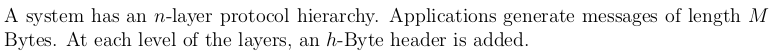

---
author: |
  | William Findlay
title: |
  | COMP3203 Final Exam Summary
date: \today
bibliography: /home/housedhorse/.bibs/uni.bib
csl: /home/housedhorse/.bibs/ieee.csl
subparagraph: yes
header-includes: |
  ``` {=latex}
  \usepackage{float}
  \usepackage{listings}
  \usepackage[hang,bf]{caption}
  \usepackage{framed}
  \usepackage[section]{placeins}

  \allowdisplaybreaks

  % fancy headers/footers
  \makeatletter
  \usepackage{fancyhdr}
  \lhead{\@author}
  \chead{}
  \rhead{\@title}
  \lfoot{}
  \cfoot{\thepage}
  \rfoot{}
  \renewcommand{\headrulewidth}{0.4pt}

  \usepackage{amsmath, amsfonts,amssymb, amsthm}
  \usepackage{siunitx}
  \usepackage[boxruled,lined,linesnumbered,titlenumbered]{algorithm2e}

  \usepackage{setspace}
  \usepackage{changepage}
  \usepackage[explicit]{titlesec}
  \usepackage{aliascnt}

  \floatplacement{figure}{!htb}
  \floatplacement{table}{!htb}
  \lstset{mathescape=true,numbers=left,breaklines=true,frame=single,language=python}
  \setlength{\captionmargin}{1in}

  \newgeometry{margin=1in}

  \newtheoremstyle{plain}
  {12pt}   % ABOVESPACE
  {12pt}   % BELOWSPACE
  {\itshape}  % BODYFONT
  {0pt}       % INDENT (empty value is the same as 0pt)
  {\bfseries} % HEADFONT
  {.}         % HEADPUNCT
  {5pt plus 1pt minus 1pt} % HEADSPACE
  {}          % CUSTOM-HEAD-SPEC

  \newtheoremstyle{definition}
  {12pt}   % ABOVESPACE
  {12pt}   % BELOWSPACE
  {\normalfont}  % BODYFONT
  {0pt}       % INDENT (empty value is the same as 0pt)
  {\bfseries} % HEADFONT
  {.}         % HEADPUNCT
  {5pt plus 1pt minus 1pt} % HEADSPACE
  {}          % CUSTOM-HEAD-SPEC

  \newtheoremstyle{remark}
  {12pt}   % ABOVESPACE
  {12pt}   % BELOWSPACE
  {\normalfont}  % BODYFONT
  {0pt}       % INDENT (empty value is the same as 0pt)
  {\itshape} % HEADFONT
  {.}         % HEADPUNCT
  {5pt plus 1pt minus 1pt} % HEADSPACE
  {}          % CUSTOM-HEAD-SPEC

  \theoremstyle{plain}

  % define theorem
  \newtheorem{theorem}{Theorem}[section]
  \providecommand*{\theoremautorefname}{Theorem}

  % define lemma
  \newtheorem{lemma}{Lemma}[section]
  \providecommand*{\lemmaautorefname}{Lemma}

  % define claim
  \newtheorem{claim}{Claim}[section]
  \providecommand*{\claimautorefname}{Claim}

  % define corollary
  \newtheorem{corollary}{Corollary}[section]
  \providecommand*{\corollaryautorefname}{Corollary}

  % define proposition
  \newtheorem{proposition}{Proposition}[section]
  \providecommand*{\propositionautorefname}{Proposition}

  % define conjecture
  \newtheorem{conjecture}{Conjecture}[section]
  \providecommand*{\conjectureautorefname}{Conjecture}

  \theoremstyle{remark}

  % define observation
  \newtheorem{observation}{Observation}[section]
  \providecommand*{\observationautorefname}{Observation}

  % define remark
  \newtheorem{remark}{Remark}[section]
  \providecommand*{\remarkautorefname}{Remark}

  \theoremstyle{definition}

  % define example
  \newtheorem{example}{Example}[section]
  \providecommand*{\exampleautorefname}{Example}

  % define definition
  \newtheorem{definition}{Definition}[section]
  \providecommand*{\definitionautorefname}{Definition}

  \newcommand{\blackbox}{\hfill$\blacksquare$}
  \usepackage{tikz}
  \newcommand*\circled[1]{\tikz[baseline=(char.base)]{
              \node[shape=circle,draw,inner sep=2pt] (char) {#1};}}

  \renewcommand{\labelitemi}{$\bullet$}
  \renewcommand{\labelitemiii}{\textbullet}
  \renewcommand{\labelitemiv}{-}

  \titleformat{\paragraph}
  {\itshape}
  {}
  {0em}
  {\underline{#1}}[ ]
  \titleformat{\subparagraph}
  {\itshape}
  {}
  {0em}
  {#1}[ ]
  ```
output:
  pdf_document:
    number_sections: true
    fig_crop: true
    fig_caption: true
    keep_tex: false
---
\newpage
\tableofcontents
\newpage
\pagestyle{fancy}

# Units

- unit chart

|prefix|base 10|base 2|
|--:|:--|:--|
|pico|$10^{-12}$|$2^{-40}$|
|nano|$10^{-9}$|$2^{-30}$|
|micro|$10^{-6}$|$2^{-20}$|
|milli|$10^{-3}$|$2^{-10}$|
|---|$10^0$|$2^{0}$|
|kilo|$10^3$|$2^{10}$|
|mega|$10^6$|$2^{20}$|
|giga|$10^9$|$2^{30}$|
|tera|$10^{12}$|$2^{40}$|
|peta|$10^{15}$|$2^{50}$|

- $Hz \implies \text{cycles per second}$
  - $GHz \implies 10^9 \text{ cycles per second}$
  - etc.

\vspace{0.25in}
\hrule

# Formulas

## Frequency
\begin{align*}
f &= \frac{1}{T}&&&&
\end{align*}

## Period
\begin{align*}
T &= \frac{1}{f}&&&&
\end{align*}

## Wavelength
\begin{align*}
\lambda &= vT&&&&\\
\lambda &= \frac{v}{f}&&&&
\end{align*}

## Bandwidth
\begin{align*}
B &= vT&&&&
\end{align*}

## Delay
\begin{align*}
D &= D_P + D_T + D_Q&&&&
\end{align*}

### Propagation
\begin{align*}
D_P &= \frac{\text{distance}}{\text{speed of light}}&&&&
\end{align*}

### Transmit
\begin{align*}
D_T &= \frac{\text{packet size}}{\text{bandwidth}}&&&&
\end{align*}

### Queue
\begin{align*}
D_Q &= \sum_{\text{nodes}}(\text{buffering + switching})&&&&
\end{align*}

### Round Trip Time
\begin{align*}
RTT &= 2D&&&&
\end{align*}

- how long does it take a packet to go **there and back**

## Overhead
\begin{align*}
T_O &= \frac{h}{p} && \text{where $h=$ overhead bits, $p=$ message bits}
\end{align*}

- **extra** over **what we want**

## Orthogonality

- take inner product of two vectors
- add them in mod 2
  - $0 \implies$ orthogonal
  - $1 \implies$ **not** orthogonal

\vspace{0.25in}
\hrule

# Error Checking
- VRC
- LRC
- **CRC**
  - this guy is usually used
  - use in tandem with ARQ
- checksum


\vspace{0.25in}
\hrule

# ARQ
- automatic repeat request
- handle errors by requesting they be resent
- use in tandem with error detection
  - **CRC**
  - checksum
- main parts
  - **ACKS**
  - **NAKS**
  - **timers**

## Sliding Window
- number frames sequentially
- window of either fixed or variable size
  - see TCP section

### Go Back N
- go back to the beginning of the window and resend everything
- $w - i = N$

### Selective Reject
- **only** resend the **damaged frame**
- need **sorting logic**
  - frames may be out of order

## Stop and Wait
- like sliding window with a **window size $=1$**


\vspace{0.25in}
\hrule

# Multiaccess
- problem of **shared channels**
  - who gets a turn?
  - how do we make sure things get to the right place?
- point-to-point is easy (by contrast)

## LANs
- local area network
- shared channel

### Switched LANs
- *interconnection* by *transmission*
- **complex**
  - routing tables
  - hierarchical addressing

### Broadcast LANs
- information *received by all*
- **simple**
  - no routing
  - flat addressing scheme
- MAC (medium access control)
- **used more often**

## Uncoordinated Access Control
- sucks
- $P(\text{exactly one talks}) = np(1-p)^{n-1}$

## MAC Protocol
- Medium Access Control
- **dynamic**
- on demand
- must **minimize** collisions
- two classes
  - random access
  - scheduling

\begin{framed}
\textbf{MAC vs Static}

MAC $\implies$ dynamic, on demand

Static $\implies$ separate dedicated channels
\end{framed}

### Centralized
- *one* **master node**
  - makes decisions for slaves nodes
- *dependent* on **master**
  - what if it fails?
  - less efficient

### Distributed
- all nodes **equivalent**
- make a decision together
  - *distributed* fashion

## How Does MAC Work?
i) **measure** prop time
i) **coordinate** access
i) **select** a winner

### Measure
- ping
- $T_{prop}= \frac{d}{v}$

### Coordinate
\begin{lstlisting}
def coordinateTwoHosts(A,B):
  A.listen(channel)

  if channel not busy:
    A.transmit(m)
    while no message from B:
      A.listen(channel)
    if time > $T_{prop}$:
      break
    else:
      A.retransmit(m)

  repeat for B
\end{lstlisting}

### Select a Winner
- let $T_A =$ time for a collision detected by A
- let $T_B =$ time for a collision detected by B
- A wins $\iff$ $T_A < T_B$
- loser is quiet until winner completes
- winner is quiet after transmission for RTT

## MAC Efficiency
\begin{align*}
E &= \frac{1}{1+2\frac{T_{prop}}{L}} &&&&
\end{align*}


\vspace{0.25in}
\hrule

# Ethernet
- **broadcast network**
  - every node can hear every other
- when collision occurs
  - stop sending
  - wait to retransmit

## Limitations
- very large packet size as bandwidth increases
- MAC is technology dependent
  - are measurements accurate?
  - measurements may differ between hosts
- but it is **realistic**
  - uptime is important

## Backoff Protocols
- **queue** of nodes **waiting to transmit**
- keep track of number of attempts
- define $P(x)$
  - probability you transmit on attempt $x$
  - decreasing in $x$

### Implementation
- station $i$ has $bck_i$
- set it to 0
- if queue not empty
  - attempt transmission with $p(bck_i)$
    - fails $\implies bck_i++$
    - succeeds $\implies bck_i := 0$
- if queue was empty, don't change $bck_i$

## Collision-Free Protocols

### Bitmap
- **contention period** = $N$ slots
- station $i$ inserts one bit into $i$th slot
- after $N$ slots, each station knows who wants to transmit
- transmit **in order**
- a station $i$ is out of luck if it becomes ready **just after** slot $i$ passes

### Tree Splitting
- nodes are leaves
- recursive
- keep taking left **subtree** until **one node** in **contention**
  - that node wins
  - take right subtree if applicable
  - walk back up to root

### Binary Countdown
- assume **all addresses** are **same length**
- node writes its bit from **highest to lowest order**
  - if I have a 0 and somebody else has a 1
    - I drop out
  - otherwise
    - I stay in
- last man standing wins


\vspace{0.25in}
\hrule

# Wireless

## Cellular
- organized into **cells**
  - hexagons
- **neighboring** cells $\implies$ **different frequency bands**

## Ad Hoc
- temporary connection
- **decentralized**
- model with a **Unit Disk Graph**
  - **points** and **circles for range**
  - $G=(V,E)$ where
    - vertices are nodes
    - edges are nodes that can each each other
    - asymmetric ranges $\implies$ directed graph

### Traversal
- **compass routing**
  - draw line $\vec{st}$
  - pick smallest angle edge $sv$
  - draw new line $\vec{vt}$
  - **doesn't always complete**
- **face routing**
  - draw line $\vec{st}$
  - **LHR** or **RHR**
  - pick a face which crosses the line
  - walk it until you are **about to cross**, then **flip face** to next

### Gabriel Test
- if **A** and **B** are **in range**
- draw a **circle** with **radius AB**
  - if there is some C inside the circle, remove link AB
  - make link AC, CB instead
- **removes all edge crossings**
- edges **preserved** are called **Gabriel edges**

## Bluetooth

### Formation
- **master nodes**
- **slave nodes**
  - bridge nodes (a special slave)

#### Rules
1. **master** only next to **slaves** (and **bridges**)
1. **slaves** only next to a **master**
1. each master's **piconet** can have **max 7 slaves**
1. bridge between **TWO** masters **ONLY**

### Joining Two Piconets
- **roles** of master and slave can **switch**
  - done by *changing frequencies*
- a slave will act as a **bridge**


\vspace{0.25in}
\hrule

# GPS

## Three Techniques

### TOA
- **time of arrival**
- compute distance from
  - three **anchor nodes**
  - use **ping time** to do this

### TDOA
- **time difference of arrival**
- difference in arrival from **two anchors**
  - $\vert t_1 - t_2\vert$
- if **speed in medium is known**
  - time $\implies$ distance
  - $v = d/t$

### AOA
- **angle of arrival**
- sensor node **determines directions**
  - from **two anchors**
- if **two sensors** on **same line**
  - use a **third anchor**

## Satellites

- three satellites 
  - $(a_1,b_1,c_1)$
  - $(a_2,b_2,c_2)$
  - $(a_3,b_3,c_3)$
- three unknowns
  - $(x,y,z)$
- solve linear system
\begin{align*}
(x-a_1)^2+(y-b_1)^2 + (z-c_1)^2 &= r_1^2 =c^2t_1^2\\
(x-a_2)^2+(y-b_2)^2 + (z-c_2)^2 &= r_2^2 =c^2t_2^2\\
(x-a_3)^2+(y-b_3)^2 + (z-c_3)^2 &= r_3^2 =c^2t_3^2
\end{align*}


\vspace{0.25in}
\hrule

# Routing
- **routing**
  - algorithm to **deliver packets**
  - two problems
    - selection
      - routing table
    - delivery
- **route discovery**
  - algorithm to **discover a route**
  - **precedes** routing

## Distance Vector
- **source** distance **is 0**
  - all **other nodes** $\infty$
- **for all edges**
  - if distance to $t$ can be shortened by taking the edge...
  - update to new lower value
- at $i$th iteration
  - all shortest paths of **length at most** $i$ **edges**
- initially
\begin{align*}
D[i,j] &= \begin{cases}
0 & \text{if $i=j$}\\
1 & \text{if $j$ is a neighbor of $i$}\\
\infty & \text{otherwise}\\
\end{cases}
\end{align*}
- then
\begin{align*}
D[i,k] &= \min_{j,k\ne i}\{w[i,j] + D[j,k]\}
\end{align*}

## Link State Protocol
- router **responsible for neighbors**
- make an LSP packet
  - ID of creator
  - list of neighbors and cost
  - sequence number
  - TTL for the packet
- LSP **transmitted** to **all routers**
  - **flooding**
- every router has a complete map
- **updating/calculation** uses **Dijkstra's**

## MST
- two standard algorithms
  - Prim
  - Kruskal

### Kruskal
- start with nodes separated
  - keep adding smallest edge that doesn't create a cycle
  - we are done when all vertices are in the tree
- time complexity
  - \# of times we change group label is at most $\log n$
  - limited by how fast we can sort the edges
    - $\boxed{(|E| \log |E|)}$

### Prim
- **(p)**rim's = **(p)**ick a node
  - pick smallest edge from that vertex that reaches an unvisited vertex
  - add that edge, now imagine the two vertices as one meta-vertex
  - repeat until we have reached the last vertex
- time complexity
  - $\boxed{O(|E| \log |E| + |V| \log |E|)}$

## Dijkstra
- add all vertices to a min-heap of $d(v)$ $Q$
  - initialize $d(s)$ is 0
  - initialize all other $d(v)$ to $\infty$
- pop $s$ and update weight of all neighbors $v$ of $s$ as $d(s) + wt(s,v)$
  - keep track that you popped it
- pop the lowest and repeat the above step for the lowest
- continue until $Q$ contains no more vertices
- time complexity
  - $\boxed{O(|E| \log |E| + |V| \log |E|)}$


\vspace{0.25in}
\hrule

# IP

## IPv4

### Classes
- five classes
  - A 7N 24H
  - B 14N 16H
  - C 21N 8H
  - D multicast
  - E experiments

{width=30%}

{width=60%}

### Subnetting

- solution when addresses can't be made "less flat"
- **only router** should be **aware**
- two levels to **three levels**
  - **net ID**
  - **subnet ID**
  - **host ID**
- single IP, **several physical networks**
  - subnets
  - near each other physically

### Subnet Masks
- 24 `1`'s
- followed by 8 `0`'s
- bitwise **AND** of **address** and **subnet mask**
  - yields **subnet number**

### Header
- **no options** $\implies$ **20 bytes**
- IHL is header length in *words*
  - a word is **32-bit**
- TOS
  - type of service
- TOS subfield
  - route selection
  - subnet service
  - queuing
- precedence subfield
  - degree of urgency
- options
  - security
  - timestamping
  - source routing
  - route recording

## IPv6
- need **more address space**
- hexadecimal digits
  - 16 bit blocks
- `block1:block2:block3:block4:block5:block6:block7:block8`
- `block1:block2::block7:block8`
  - in this example blocks 3-6 inclusive are all 0's
- `128.33.87.51` = `::00FF:128.33.87.51`
- prefixes
  - `001` global unicast
  - `010` provider based

### Neighbor Discovery
- each router periodically sends advertisements on subnets
- indicate
  - IP address
  - gateway functionality
  - link layer address
  - network prefixes
  - etc.
- *automatically identify* routers in the **subnet**

## DHCP
- **automate** IP configuration
- **host broadcasts** *discover message* to **physical network**
- **server** responds with *offer message*
- host accepts an offer
- server sends DHCP ACK and assigns the IP
  - for a period of time $T$ and two thresholds
  - $T_1,T_2=T/2,7T/8$
- $T_1$ is period before it asks to **renew lease**
- $T_2$ is is period before it starts broadcasting to **any server** on network
- $T$ is period before it must **start from beginning**

## ARP
- **address resolution protocol**
- translates IP understood locally
- allows hosts to build tables
- updates every 15 minutes

## RARP
- **reverse address resolution protocol**
- obsolete
- request IP address from a computer network


\vspace{0.25in}
\hrule

# TCP

## How it Works (Sliding Window)
- **byte oriented**
  - sender writes bytes into
  - receiver reads from
- variable Max Segment Size
  - decides when it has enough bytes $(=MSS)$
  - or sending process requests packets
  - timer can trigger transmissions

### Opening Connection
- A sets SYN bit and register a SEQ\#
- B sets SYN bit and registers a SEQ\#
  - acknowledges with A's SEQ\# + 1
- A acknowledges with B's SEQ\# + 1
- this is important because
  - A informs B of its starting number
  - B acknowledges and informs A of its own starting number
  - A acknowledges B's starting number
- in this way, they can anticipate what the other will do
- a timer makes sure that if an expected response is not received, they will retry

### Closing Connection
- A sets FIN bit with SEQ\#
- B responds with its own FIN bit
- A acknowledges

### Sliding Window (Important)

- **credit allocation scheme**
- each byte transmitted has a sequence number
- sender includes SEQ\# of first byte
- receiver acknowledges
  - $(A=i,W=j)$
  - all bytes up to $i-1$ are acknowledged
  - next byte has SEQ\# $i$
  - grant permission to send next $i,i+1,\ldots,j-1$ bytes
- keep track of a congestion window $w$ locally
  - if $W < w$, increase it by sending out a packet
  - if $W \ge w$, wait for ACK and reduce $W$ (and increase $w$)

## Building Statistics

### Average Round Trip Time

- $RTT(i) =$ round trip time for $i$th segment
- $ARTT(k) =$ **average** round trip time for first $k$ segments
\begin{align*}
ARTT(k+1) &= \frac{1}{k+1}\sum_{i=1}^{k+1}RTT(i)
\end{align*}
- observe we have coefficient $\frac{1}{k+1}$ for all terms
- or, recursively
\begin{align*}
ARTT(k+1) &= \frac{k}{k+1}ARTT(k) + \frac{1}{k+1}RTT(K+1)
\end{align*}
- observe we have coefficient $\frac{k}{k+1}$ and $\frac{1}{k+1}$

### Smoothed Round Trip Time

- $SRTT(k) =$ smoothed RTT estimate
- defined by recursion
\begin{align*}
SRTT(K=1) &= \alpha SRTT(k) + (1-\alpha)RTT(k+1)
\end{align*}
- $\alpha$ further from $k \implies$ less weight assigned

### Traffic Variance

- calculate error then calculate standard deviation
\begin{align*}
AERR(k+1) &= RTT(k+1) - ARTT(k)\\
ADEV(k+1) &= \frac{1}{k+1}\sum_{i=1}^{k+1}{\vert AERR(i)\vert}\\
\end{align*}

### RTT Variance Estimation

- **Jacobson's**
  - works for no retransmissions
- **Exponential RTO Backoff**
  - good for when a retransmission occurs
- **Karn's** (best of both worlds)
  - do not use measured RTT for retransmitted segments
  - calculate backoff RTO when retransmission occurs
  - use backoff RTO until we get an ACK for a new segment
    - then start using Jacobson's again

## Equilibrium Model

- **loss** $\implies$ decrease $w$
  - $w = \frac{w}{2}$
- **no loss** $\implies$ increase $w$
  - $w = w + \frac{1}{w}$


\vspace{0.25in}
\hrule

# Sample Test

\renewcommand{\thesubsection}{\arabic{subsection}}

## <!-- 1 -->

{width=80%}

###

{width=80%}
\begin{align*}
\text{overhead} &= \frac{nh}{nh + M}
\end{align*}

###

{width=80%}
\begin{align*}
\text{overhead} &= \frac{nh}{nh + M}\\
10\% &\ge \frac{nh}{nh + 20h}\\
\frac{1}{10} &\ge \frac{n}{n + 20}\\
(n + 20)\frac{1}{10} &\ge n\\
(n + 20)\frac{1}{10} &\ge n\\
\frac{n}{10} + 2 &\ge n\\
n + 20 &\ge 10n\\
20 &\ge 9n\\
n &\le \frac{20}{9}\\
\end{align*}

###

{width=80%}

Take inner product of vectors in$\mod 2$.
\begin{align*}
\langle\vec{A},\vec{B}\rangle \mod 2 &= 1+0+0+0+0+1+0+1+1 \mod 2\\
&= 0 && \iff \text{orthogonal}
\end{align*}

## <!-- 2 -->

{width=80%}
\begin{align*}
x &= d\frac{\tan \alpha \tan \beta}{\tan \alpha + \tan \beta}\\
x &= \SI{1000}{\meter}\frac{\tan \frac{\pi}{3} \tan \frac{\pi}{4}}{\tan \frac{\pi}{3} + \tan \frac{\pi}{4}}
\end{align*}

## <!-- 3 -->

{width=80%}

Slot|Station
---:|:------
   1|a e f g h
   2|a      
   3|e f g h
   4|e f   
   5|e      
   6|f      
   7|g h    
   8|g      
   9|h      

## <!-- 4 -->

{width=80%}

###

{width=80%}

 Face|List of Edges Being Traversed
----:|:----------------------------
$F_2$|4                        
$F_3$|12,13                           
$F_5$|14, 15                        

###

{width=80%}

\begin{center}
4, 9, 10, 11, 14, 15
\end{center}

## <!-- 5 -->

{width=80%}

### A

- **valid**
  - all piconets have slavecount $\le 7$
  - all piconets have slaves
  - no adjacent masters
  - no adjacent slaves
  - bridge connects **two** piconets by their master nodes

### B

- **invalid**
- the good
  - all piconets have slavecount $\le 7$
  - no adjacent masters
  - no adjacent slaves
- the bad
  - bridge connects **three** piconets by their master nodes
  - should be **TWO**
  - one piconet has **no slaves**

## <!-- 6 -->

{width=80%}

Define event $A$ is both stations select same frequency.
\begin{align*}
P(A) &= n\frac{1}{n}\frac{1}{n}\\
&= \frac{1}{n}
\end{align*}

## <!-- 7 -->

{width=80%}

###

Give the values $x_1,x_2,x_3$.
\begin{align*}
x_1 &= 1 + (-1)^1 = 1 - 1 = 0\\
x_2 &= 2 + (-1)^2 = 2 + 1 = 3\\
x_3 &= 3 + (-1)^3 = 3 - 1 = 2
\end{align*}

###

{width=80%}

In order for the graph to be connected, we need some node with an x-coordinate of 1 at a bare minimum.

Is it possible to have such an x-coordinate?
\begin{align*}
1 &= i + (-1)^i\\
i &= 0
\end{align*}

Our $i \in \{1,2,\ldots,n\} \implies i\ne 0$. Therefore it is not a connected graph.
